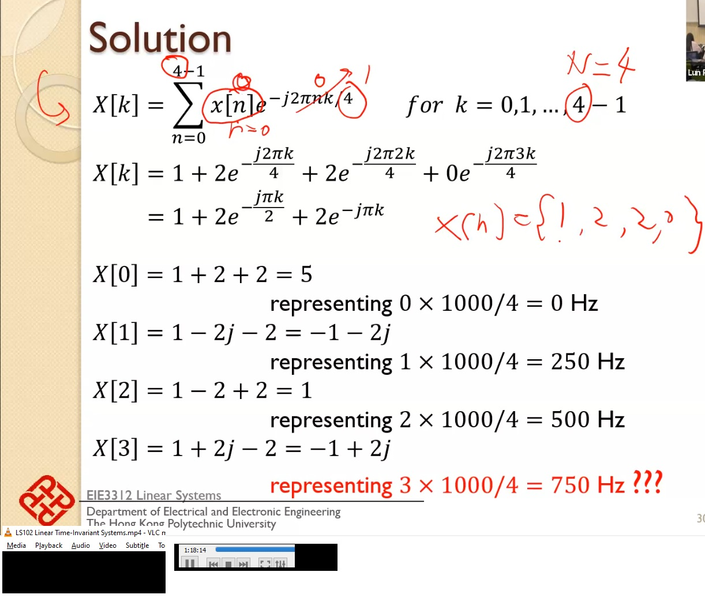

[c-dft](https://dirkarnez.github.io/c-dft/)
===========================================

- [DFT Graphical Interpretation: Centroids of Weighted Roots of Unity - Cedron Dawg](https://www.dsprelated.com/showarticle/768.php)
  - ```python
    S = np.fft.fft(np.array([1, 2, 2, 0]))        
    print(S)
    ```
- exp(sqrt(-1) * 3.14) = -0.9999
  - pi is only 180 degree when presented (and radian is the unit), pi is always 3.14.. when doing calculation

### Tutorials
- [**Discrete Fourier Transform - Simple Step by Step - YouTube**](https://www.youtube.com/watch?v=mkGsMWi_j4Q)
  - very very good
