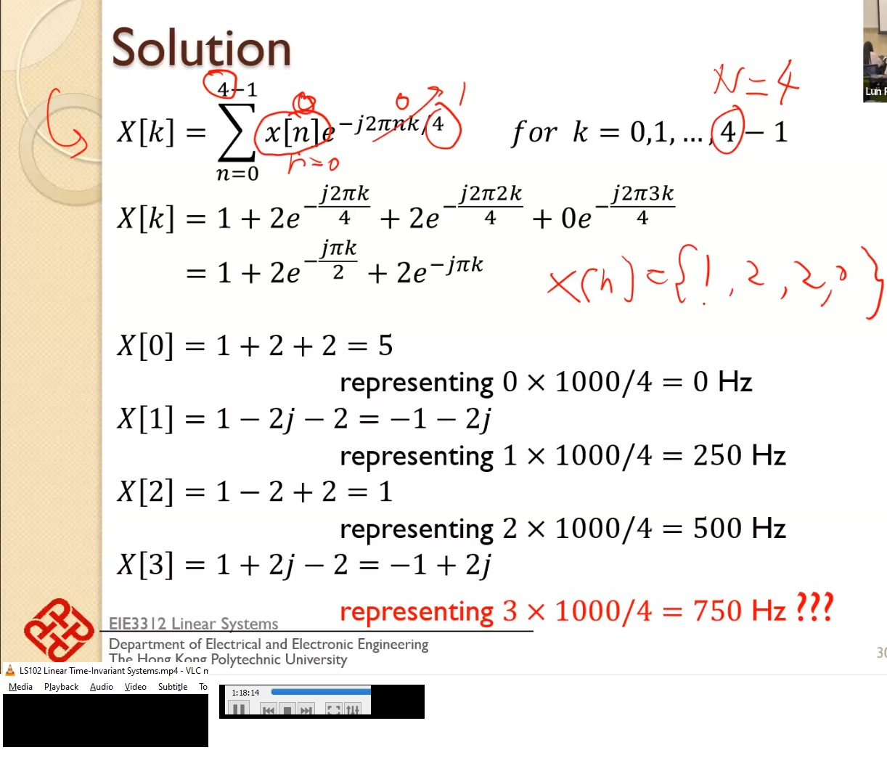

[c-dft](https://dirkarnez.github.io/c-dft/)
===========================================

- [DFT Graphical Interpretation: Centroids of Weighted Roots of Unity - Cedron Dawg](https://www.dsprelated.com/showarticle/768.php)
  - Basic mathematical
    ```python
    S = np.fft.fft(np.array([1, 2, 2, 0]))        
    print(S)
    ```
  - Do this on real signals (`rfft`, `rfftfreq`)
    ```python
    import numpy as np
    
    signal = np.array([1, 2, 2, 0], dtype=float)
    sample_rate = 1000
        
    fourier = np.fft.rfft(signal)
    freq = np.fft.rfftfreq(signal.size, d=(1/sample_rate))
    print(fourier)
    print(freq)
    ```
  - IDFT
    ```python
    import numpy as np
    
    signal = np.array([1, 2, 2, 0], dtype=float)
    
    fourier = np.fft.fft(signal)
    print(f"fourier {fourier}")

    n = np.arange(signal.size)  # 時域索引 [0, 1, 2, 3]
    k = np.arange(signal.size)  # 頻域索引 [0, 1, 2, 3]

    # 注意：IDFT 使用正指數 (+2j)，且最後要除以 N
    IDFT_MAT = np.exp(2.0j * np.pi * n[:, None] * k[None, :].astype(float) / signal.size) / signal.size

    # 3. 矩陣相乘還原訊號
    recovered_signal = IDFT_MAT @ fourier
    print(f"Recovered: {recovered_signal.real}")  # 取實部
    ```


- exp(sqrt(-1) * 3.14) = -0.9999
  - pi is only 180 degree when presented (and radian is the unit), pi is always 3.14.. when doing calculation

### Notes
- > Scaling Factor: The DFT outputs include a scaling factor based on the number of samples. If you want to obtain the true amplitude of the frequency components, you need to scale the result appropriately. For an N-point DFT, the magnitudes are typically scaled by 1/N.

### Integration
- [Signals and Sine Waves (Learn Web Audio from the Ground Up, Part 1)](https://teropa.info/blog/2016/08/04/sine-waves)
- [Synthesizing sound with JavaScript: sine wave | by Ivan Sergiienko | Medium](https://darthvanger.medium.com/synthesize-sound-with-javascript-sine-wave-940f9cd7dae2)
- [Oscillating sine wave, including the steps to figuring out how to plot a sine wave · GitHub](https://gist.github.com/gkhays/e264009c0832c73d5345847e673a64ab)

### Tutorials
- [**Discrete Fourier Transform - Simple Step by Step - YouTube**](https://www.youtube.com/watch?v=mkGsMWi_j4Q)
  - very very good
